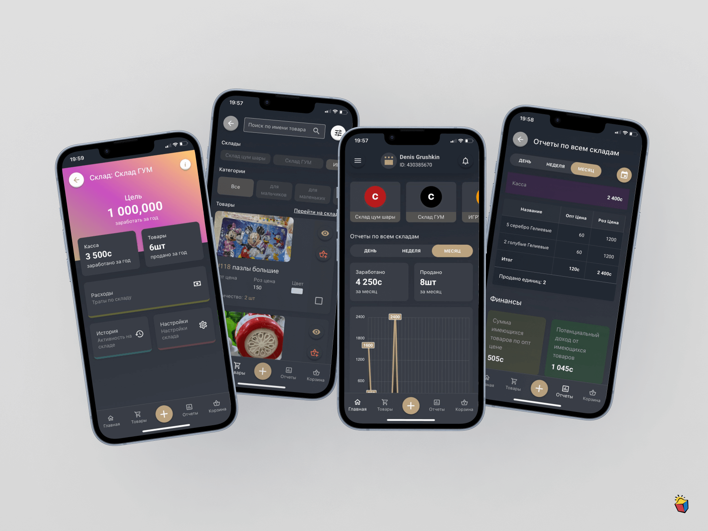

# Sklad

Your smart merchandise management assistant! 📦💼



[Demo](https://t.me/SkladManagerBot)

## Install the dependencies

```bash
yarn
# or
npm install
```

### Start the app in development mode (hot-code reloading, error reporting, etc.)
```bash
quasar dev
```

### Lint the files
```bash
yarn lint
# or
npm run lint
```

### Format the files
```bash
yarn format
# or
npm run format
```

### Build the app for production
```bash
quasar build
```

### Customize the configuration
See [Configuring quasar.config.js](https://v2.quasar.dev/quasar-cli-webpack/quasar-config-js).

### Build .aab to .apk

https://www.geekdashboard.com/extract-apk-files-from-aab/

```bash
java -jar bundletool.jar build-apks --bundle=app-release.aab --output=app.apks --mode=universal
```

### Build android app

https://quasar.dev/quasar-cli-vite/developing-cordova-apps/publishing-to-store/

1. zipalign -v 4 ./src-cordova/platforms/android/app/build/outputs/bundle/release/app-release.aab sklad.aab

2. apksigner sign --ks my-release-key.keystore --min-sdk-version 22 --ks-key-alias alias_name sklad.aab

## If get error when install deps

```bash
sudo apt-get install build-essential libcairo2-dev libpango1.0-dev libjpeg-dev libgif-dev librsvg2-dev
```